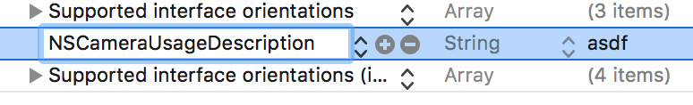
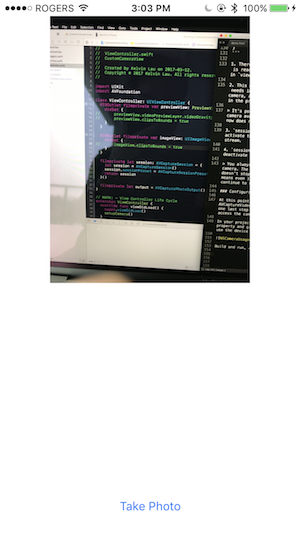

# CustomCameraDemo

This is a barebones implementation on how to get a custom camera working using AVFoundation in iOS 10.

## Guide

### Setting up Main.storyboard

Create a brand new Xcode project. Open up the `main.storyboard` file and add the following UI elements to the View Controller:


1. This is a `UIView`. This is the preview view that shows whatever the iPhone camera is viewing.

2. This is a `UIImageView`. You will make this hold the image of the snapshot you take.

3. This is a `UIButton`. You will make this trigger the snapshot of the current camera's view.

### Creating a Preview View

The preview view shows what the iPhone camera is currently seeing. Create a new Swift file and name it **PreviewView** and update the contents to the following:

```swift
import UIKit
import AVFoundation

final class PreviewView: UIView {

  // 1
  override class var layerClass: AnyClass {
    return AVCaptureVideoPreviewLayer.self
  }

  // 2
  var videoPreviewLayer: AVCaptureVideoPreviewLayer {
    return layer as! AVCaptureVideoPreviewLayer
  }

  // 3
  var session: AVCaptureSession? {
    get {
      return videoPreviewLayer.session
    }
    set {
      videoPreviewLayer.session = newValue
    }
  }
  
}
```

1. By default, `layerClass` returns a `CALayer`. In order to show what your iPhone's camera is viewing, you'll need to return a `AVCaptureVideoPreviewLayer` class instead. 

2. You create a convenient computed property that returns that layer. 

3. `AVCaptureVideoPreviewLayer` is responsible for showing the camera view, but it cannot do it alone. An `AVCaptureSession` is required to stream it live video data. Here, you create a property that allows `PreviewView` to accept a `AVCaptureSession` object.

Using a setter, you will give your `videoPreviewLayer` the `AVCaptureSession` it needs to start showing your live camera feed.

Before continuing, update the `UIView` in the storyboard to use this custom subclass:


### Configuring the View Controller's Properties

Open `ViewController.swift` and update the file to the following:

```swift
import UIKit
import AVFoundation

final class ViewController: UIViewController {
  
  // 1
  @IBOutlet fileprivate var previewView: PreviewView!
  @IBOutlet fileprivate var imageView: UIImageView! 

  // 2
  fileprivate let session: AVCaptureSession = {
  	let session = AVCaptureSession()
  	session.sessionPreset = AVCaptureSessionPresetPhoto
  	return session
  }()

  // 3
  fileprivate let output = AVCapturePhotoOutput()
}
```

1. Hook up the `@IBOutlet`s to the storyboard.

2. This is the `AVCaptureSession` that will manage the iPhone's camera. This is the "command center" for `AVFoundation`. You set the `sessionPreset` to photo capturing mode. 

3. `AVCapturePhotoOutput` is the actual class responsible for initiating a request for image capture. You create and hold a reference to that property here.

### Configuring the View Controller's Life Cycle

At the bottom of `ViewController.swift`, add the following extension:

```swift
// MARK: - View Controller Life Cycle
extension ViewController {

  // 1
  override func viewDidLoad() {
    super.viewDidLoad()
    setupCamera()
  }
  
  // 2
  private func setupCamera() {
    let backCamera = AVCaptureDevice.defaultDevice(withMediaType: AVMediaTypeVideo)
    guard let input = try? AVCaptureDeviceInput(device: backCamera) else { fatalError("back camera not available.") }
    session.addInput(input)
    session.addOutput(output)
    previewView.session = session
  }
  
  // 3
  override func viewWillAppear(_ animated: Bool) {
    super.viewWillAppear(animated)
    session.startRunning()
  }
  
  // 4
  override func viewWillDisappear(_ animated: Bool) {
    super.viewWillDisappear(animated)
    session.stopRunning()
  }
}
```

1. There are more configuration steps before your `AVCaptureSession` is ready to begin managing the camera. You'll do the configuration in `viewDidLoad`.

2. This method bundles the configuration steps. A `AVCaptureSession` needs inputs and outputs. For this demo, your input is the back camera, and your output is the `AVCapturePhotoOutput` you created in the properties section.

> It's possible that the user's device does not have the back camera available (or perhaps it's not functional). The code right now does not handle that gracefully. 

3. `session.startRunning()` tells the `AVCaptureSession` to activate the iPhone's camera and begin managing the video data stream.

4. `session.stopRunning()` tells the `AVCaptureSession` to deactivate the iPhone's camera.

> You always want to stop the session when you don't need the camera. The iPhone's camera uses alot of processing power and doesn't stop until it receives the `stopRunning` command. This means even if you segue to another screen in your app, it will continue to run unless `stopRunning` is called.

### Configuring the Plist

At this point, you've written enough code for the `AVCaptureVideoPreviewLayer` to show the camera feed. There's just one last step before you can test it out. Every app that wants to access the camera needs to ask the user for permission first. 

In your project's `info.plist`, add the `NSCameraUsageDescription` property and give it a string that describes why your app needs to use the device camera:



Build and run, and check out your screen:



### Configuring the UI

The `PreviewView` doesn't look good. Let's fix that and have the preview span the entire top half of the screen. Find the `IBOutlet`s that you created earlier and update them to the following:

```swift
@IBOutlet fileprivate var previewView: PreviewView! {
  didSet {

    // 1
    previewView.videoPreviewLayer.videoGravity = AVLayerVideoGravityResizeAspectFill

    // 2
    previewView.clipsToBounds = true
  }
}

@IBOutlet fileprivate var imageView: UIImageView! {
  didSet {
    imageView.clipsToBounds = true
  }
}
```

1. Recall that the `videoPreviewLayer` is the `AVCaptureVideoPreviewLayer` that handles the presentation of the iPhone camera's view. You modify the `videoGravity` of that to `AVLayerVideoGravityResizeAspectFill`, AKA span the whole view.

2. The preview view can present the video feed beyond the bounds of it's view. Set `clipsToBounds` to fix that. (Try deleting that line to see what happens)

Build and run again to check things out.

### Adding Image Capture

In iOS 10, a new delegate named `AVCapturePhotoCaptureDelegate` is responsible for handing back information from an image capture request. 

At the bottom of `ViewController.swift`, add the following extension:

```swift
// MARK: - AVCapturePhotoCaptureDelegate
extension ViewController: AVCapturePhotoCaptureDelegate {
    func capture(_ captureOutput: AVCapturePhotoOutput, didFinishProcessingPhotoSampleBuffer photoSampleBuffer: CMSampleBuffer?, previewPhotoSampleBuffer: CMSampleBuffer?, resolvedSettings: AVCaptureResolvedPhotoSettings, bracketSettings: AVCaptureBracketedStillImageSettings?, error: Error?) {

    // 1
    guard let sampleBuffer = photoSampleBuffer else { fatalError("sample buffer was nil") }

    // 2
    guard let imageData = AVCapturePhotoOutput.jpegPhotoDataRepresentation(forJPEGSampleBuffer: sampleBuffer, previewPhotoSampleBuffer: nil) else { fatalError("could not get image data from sample buffer.") }

    // 3
    imageView.image = UIImage(data: imageData)
  }
	
}
```

There are many callbacks that `AVCapturePhotoCaptureDelegate` provides, but all of them are optional. Some are required depending on the context of the image capture request. For this demo, you'll only care about taking a photo with default settings, and this method will pass back the data required to reconstruct the captured image.

Here's what happened here:

1. The `photoSampleBuffer` is an optional that contains the image buffer required to reconstruct the image. 

2. Using the `photoSampleBuffer`, you can recreate the image in `Data` form by using a class method from `AVCapturePhotoOutput`

3. With the `Data` of the image, you reconstruct the `UIImage` and set it to your `UIImageView` you added in the storyboard.

Before you can actually test this, you need to initiate an image capture request. 

### Starting a Capture Request

At the bottom of `ViewController.swift`, add the following extension:

```swift
// MARK: - @IBActions
private extension ViewController {
  @IBAction func capturePhoto() {

    // 1
    let captureSettings = AVCapturePhotoSettings()
    captureSettings.isAutoStillImageStabilizationEnabled = true

    // 2
    output.capturePhoto(with: captureSettings, delegate: self)
  }
}
```

1. Each capture request requires a `AVCapturePhotoSettings` object. This is an object that encapsulates the context of the capture request. For instance, you can modify the behavior of the camera flash, or opt in or out of the image stabilization feature. Each one of these capture settings can only be used once. 

2. With the capture settings, you initialize a new capture request.

Build and run, demo complete!

> We took many shortcuts in this demo. For instance, the chance that the device's camera is not active is quite real. You should handle that properly. You can also attach different inputs to use the front camera instead of the back camera. You can also opt in for high resolution images. Refer to the WWDC 2016 session 501 for more details on more custom operations. But for now, this is a great start :)

